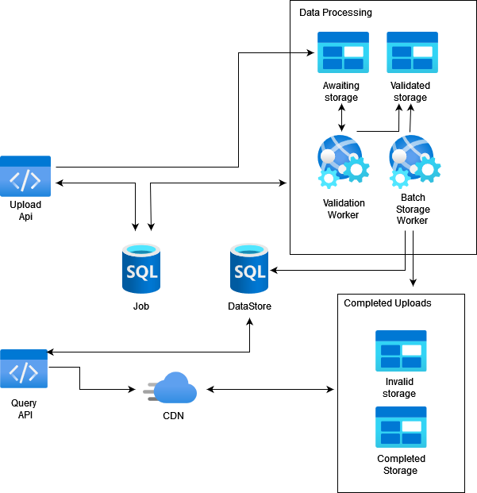

# DWS_CDR_API
Tech test for DWS

Hosted [here]("https://dws.jwm.xyz/swagger/index.html")

## Tech

### Tools
- Swagger - for API documentation
- Moq - for mocking in unit tests
- CSvHelper - For parsing CSV
- EntityFramework (with bulk extensions) - DB Read/Write

### Architecture

#### Cdr.Api

- Validates incoming request objects and standardises return object.
- Masks any exceptions thrown anywhere within the application
	+ See `Cdr.Api/Pipleine`
- Controller end points for various routes within application
	+ See `Postman/Cdr Api.postman_collection` or swagger documentation
- Holds startup services and middleware registration

#### Cdr.Api.Services

- Business Logic
- Interface between data access and API presentation layers

#### Cdr.DataAccess

- Data Access Layer
- Interacts with database (duh)

#### Cdr.DataAccess.Migrations

- Used for changes within the database through code first EF
- Currently used SQLlite for this test.

#### Cdr.ErrorManagement

- Error/Exception handling 
- This ideally would be a standardised organisation package install via `Nuget` 
	+ Any specific errors would be loaded and injected
	
#### Cdr.SharedLibrary

- A project used for sharing throughout the project
- Normally would store DTO objects etc and other utility/helper functions

## Assumptions
- It is assumed that the incoming `.csv` is well formed and validated
	+ This is external data and should be from a trusted source. If something is incorrectly formatted or an error detected it is not our decision to modify the data as we do not understand the full context. 
	+ inserting should be atomic.
- A proper RDBM would be used for proper Data Annotations
	+ SQL lite is used for simplicity for this tech test
	+ SQL Lite does not support certain functionality around `decimal` such as `orderby`, `sum`
		* This project casts these to double so there are rounding errors.
- The `flush` endpoint would never exist. This is for this tech test only.

## Getting Started

### Prerequisites

- .Net 7
- Entity framework
	+ `dotnet tool install --global dotnet-ef`

### Setup 

- Clone this Repo
- Navigate to `..\src\Crd.DataAccess.Migrations`
- Within powershell run `dotnet ef database update`
 	+ This will create the SQL lite db
 - Navigate back to the `src` directory
 - Run `dotnet run --project cdr.Api`

 - Swagger documentation will be `http://localhost:<port>/swagger/index.html`

### Improvements/Enhancements
- Improved test cases and test coverage (unit/E2E/integration tests)
- Improved Postman collection covering all flows with tests.
- Improved Logging integration
- Improved Swagger documentation/examples inline with OAS
- API Versioning
- This API should not write bulk files to the database AND function as an API.
	+ A potential alternative is the API should take any incoming `.csv` files and push them to blob storage `waiting` folder
		* A Job should be created for tracking
	+ These files should then be checked for validity via some service and moved to a `waitingValidating` folder for processing
	+ Then, a listener/CRON/consumer etc function should poll blob storage for any files within `waitingValidating`
	+ This listener/CRON/consumer should then process the records as batches into a staging table.
	+ A CRON/other function, should then be run to insert entries from the staging table to the required table
		* Any errors should be reported back into another table with the job id
	+ Completed files should then be moved into completed blob storage or invalid storage for reprocessing. 
		

  

